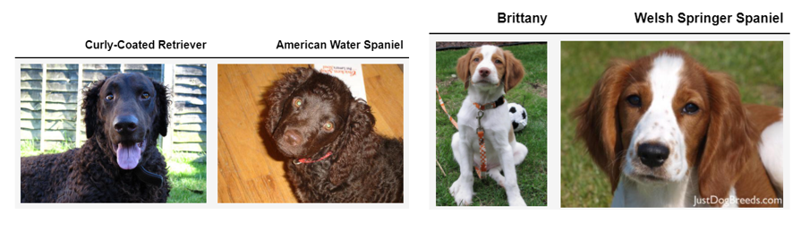
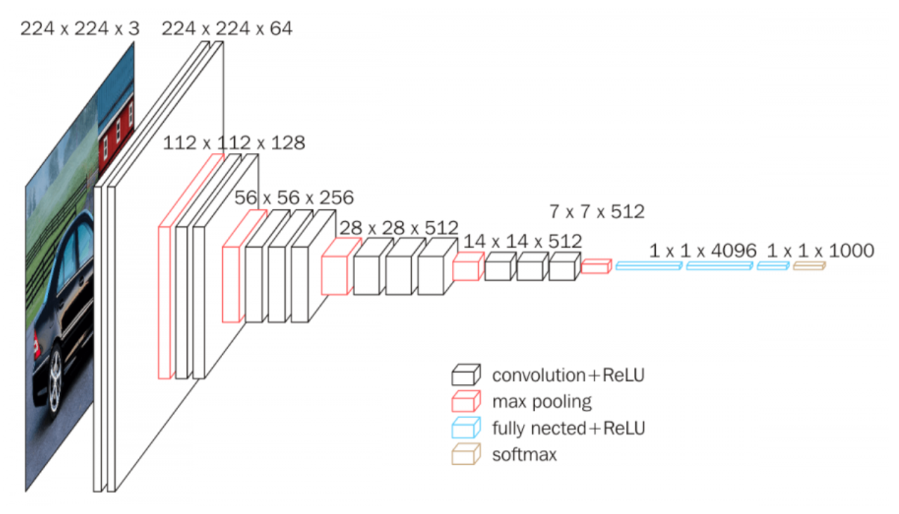
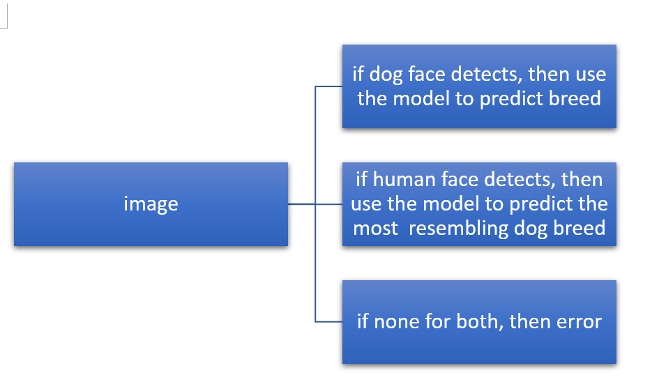
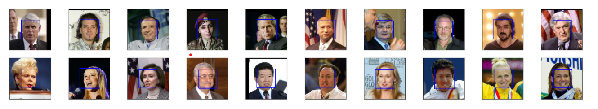
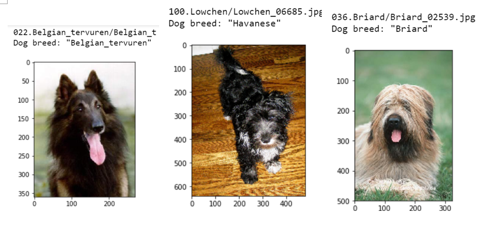
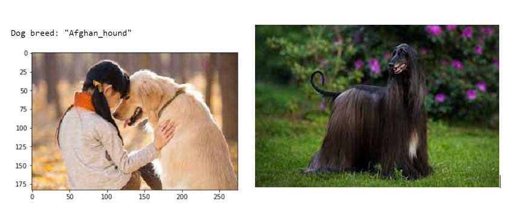

# Udacity-DataScience-Capstone-project
Udacity data science nanodegree project 4

### Table of contents

1. [Libraries used](#Libraries)
2. [Project Inspiration](#Inspiration)
3. [File Descriptions](#files)
4. [Data Insights](#Insights)
5. [Licensing, Authors, and Acknowledgements](#licensing)

## Libraries used 

Python version 3.0.
Plugins and imports used were: Keras, Pandas, MatplotLib.
Libraries:Scikit-learn, numpy, matplotlib, os, glob

## Project Inspiration

Have you ever had a time that when we walk on street or look on instagram, seen a cute dog and don’t know what breed it is. This is exhuasting for many of us, we are all dog lovers, so dog breed classifier comes handy for us. Why dog breed classifier is challenging? These 2 sets of dog comaprsion may give us a taste of it. Human eyes barely can tell the differences.

## File Descriptions 

*__dog_breed_classifier.ipynb__* : Jupyter notebook containing all the codes and results

*__dog_breed_classifier.html__* : Jupyter notebook in hmtl form containing all the codes and results

*__saved_models__* : A folder contains 3 models I trained, CNN from scratch, vgg16 CNN, and ResNet-50 CNN

*__Dog_img__* :  A folder contains all the images I used for the test from internet

*__Asset__* : Pictures I used for write ReadMe file

## Insights

I build a CNN using transfer learning to classify dog breeds that can reach 85% accuracy on test data. Then: 

what is an CNN, what is VGG16? etc

How this classifier works?

Before we dive into details, take a look of our dataset, human faces 

How the classifier performs on test images?

How the classifer performs in real life? 

At the end, using ResNet-50 transfer learning we build a CNN can reach 85% test accuracy, which is perfect for us. Also there are some posiible improvements, all the detials is discussed in this [post](https://medium.com/@ruoruolove/dog-breed-classifierintroduction-95b76d57c164)

## Licensing, Authors, Acknowledgements

Authors: [here](https://medium.com/@ruoruolove/dog-breed-classifierintroduction-95b76d57c164)

